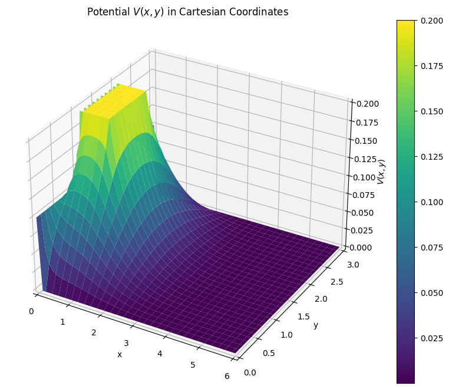
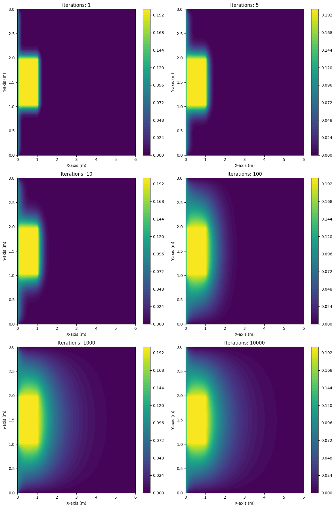
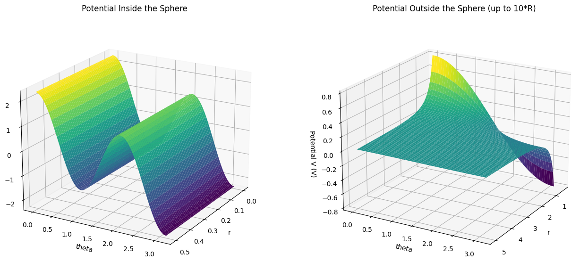
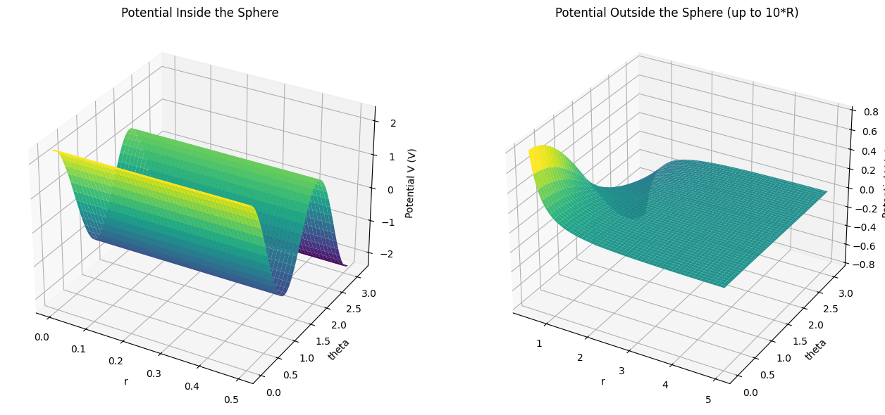

# Numerical Solutions of Laplace Problem 3.3 and 3.18 #


```python
import numpy as np
import matplotlib.pyplot as plt
from scipy.special import lpmv
```


```python
#parameters
V_0 = 0.1  #boundry condition of the wall
radi = 0.5  #radius
kappa = 0.2  #scaling factor for potential
width, height = 6, 3  #match professors boundry domain
dx = 0.1 #spatial step size
```


```python
def setup_grid(width, height, dx):
    """
    create a mesh grid based on the given dimensions and spacing

    parameters:
    - width (float): width of the grid
    - height (float): height of the grid
    - dx (float): grid spacing

    returns:
    - X (ndarray): mesh grid for the x-coordinates
    - Y (ndarray): mesh grid for the y-coordinates
    - nx (int): # of grid points along the x-axis
    - ny (int): # of grid points along the y-axis
    """
    nx, ny = int(width / dx), int(height / dx)
    x = np.linspace(0, width, nx)
    y = np.linspace(0, height, ny)
    X, Y = np.meshgrid(x, y)
    return X, Y, nx, ny


def initialize_potential(nx, ny, V_0, radi, dx, kappa):
    """
    initialize the potential array and apply boundary conditions

    parameters:
    - nx (int): # of grid points along the x-axis
    - ny (int): # of grid points along the y-axis
    - V_0 (float): Boundary condition value at x=0
    - radi (float): Radius of the obstacle
    - dx (float): Spatial step size
    - kappa (float): Scaling factor for the obstacle potential

    returns:
    - V (ndarray): Initial potential array with boundary conditions applied
    """
    V = np.zeros((ny, nx))
    V[:, 0] = V_0  # Wall at x=0
    # Applying obstacle boundary condition
    V[int(ny/2 - radi/dx):int(ny/2 + radi/dx), int(nx/10 - radi/dx):int(nx/10 + radi/dx)] = kappa
    return V


def solve_laplace(V, nx, ny, radi, dx, kappa, tolerance=1e-4, max_iterations=40):
    """
    Solve Laplace's equation iteratively to find the potential distribution with a maximum iteration limit

    parameters:
    - V (ndarray): Initial potential array
    - nx (int): # of grid points along the x-axis
    - ny (int): # of grid points along the y-axis
    - radi (float): Radius of the obstacle
    - dx (float): Spatial step size
    - kappa (float): Scaling factor for the obstacle potential
    - tolerance (float): Error tolerance for convergence (default is 1e-4)
    - max_iterations (int): Maximum # of iterations (default is 40)

    returns:
    - V (ndarray): Potential array after solving Laplace's equation iteratively
    """
    error = 1
    iteration = 0
    while error > tolerance and iteration < max_iterations:
        V_new = V.copy()
        # Update potential inside the grid
        V_new[1:-1, 1:-1] = 0.25 * (V[1:-1, :-2] + V[1:-1, 2:] + V[:-2, 1:-1] + V[2:, 1:-1])
        # Apply the obstacle boundary condition at each iteration
        V_new[int(ny/2 - radi/dx):int(ny/2 + radi/dx), int(nx/10 - radi/dx):int(nx/10 + radi/dx)] = kappa
        # Calculate error
        error = np.max(np.abs(V_new - V))
        V = V_new
        iteration += 1  # Increment the iteration counter
    return V


def plot_potential(X, Y, V, width, height):
    """
    Plot the potential array as a 3D surface

    parameters:
    - X (ndarray): Mesh grid for the x-coordinates
    - Y (ndarray): Mesh grid for the y-coordinates
    - V (ndarray): Potential array
    - width (float): Width of the grid
    - height (float): Height of the grid
    """
    fig = plt.figure(figsize=(12, 8))
    ax = fig.add_subplot(111, projection='3d')
    surf = ax.plot_surface(X, Y, V, cmap='viridis', edgecolor='none')
    fig.colorbar(surf)
    ax.set_title('Potential $V(x, y)$ in Cartesian Coordinates')
    ax.set_xlabel('x')
    ax.set_ylabel('y')
    ax.set_zlabel('$V(x, y)$')
    ax.set_xlim(0, width)
    ax.set_ylim(0, height)
    ax.set_zlim(0, .2)
    plt.show()

```


```python
X, Y, nx, ny = setup_grid(width, height, dx)
V = initialize_potential(nx, ny, V_0, radi, dx, kappa)
V = solve_laplace(V, nx, ny, radi, dx, kappa, max_iterations=1000) #prof had this at 40
plot_potential(X, Y, V, width, height)
```


    

    


```python
def solve_laplace_specific_iterations(V, nx, ny, radi, dx, kappa, iterations):
    """
    Solve Laplace's equation for specific iterations to observe the evolution of the potential

    parameters:
    - V (ndarray): Initial potential array
    - nx (int): # of grid points along the x-axis
    - ny (int): # of grid points along the y-axis
    - radi (float): Radius of the obstacle
    - dx (float): Spatial step size
    - kappa (float): Scaling factor for the obstacle potential
    - iterations (list): List of specific iteration numbers to capture snapshots

    returns:
    - snapshots (dict): Dictionary containing potential arrays at specified iterations
    """
    snapshots = {}
    for iteration in range(max(iterations)+1):
        V_new = V.copy()
        # Update potential inside the grid
        V_new[1:-1, 1:-1] = 0.25 * (V[1:-1, :-2] + V[1:-1, 2:] + V[:-2, 1:-1] + V[2:, 1:-1])
        # Apply the obstacle boundary condition
        V_new[int(ny/2 - radi/dx):int(ny/2 + radi/dx), int(nx/10 - radi/dx):int(nx/10 + radi/dx)] = kappa
        V = V_new
        if iteration in iterations:
            snapshots[iteration] = V.copy()
    return snapshots


def plot_multiple_iterations(X, Y, snapshots, width, height):
    """
    Plot the potential array at different iterations in a subplot layout

    parameters:
    - X (ndarray): Mesh grid for the x-coordinates
    - Y (ndarray): Mesh grid for the y-coordinates
    - snapshots (dict): Dictionary containing potential arrays at different iterations
    - width (float): Width of the grid
    - height (float): Height of the grid
    """
    fig, axes = plt.subplots(nrows=3, ncols=2, figsize=(12, 18))
    iteration_keys = sorted(snapshots.keys())
    for ax, iteration in zip(axes.flatten(), iteration_keys):
        surf = ax.contourf(X, Y, snapshots[iteration], levels=50, cmap='viridis')
        fig.colorbar(surf, ax=ax)
        ax.set_title(f'Iterations: {iteration}')
        ax.set_xlabel('X-axis (m)')  # Label for x-axis
        ax.set_ylabel('Y-axis (m)')  # Label for y-axis
        ax.set_xlim(0, width)
        ax.set_ylim(0, height)
    plt.tight_layout()
    plt.show()


```


```python
X, Y, nx, ny = setup_grid(width, height, dx)
V = initialize_potential(nx, ny, V_0, radi, dx, kappa)
iterations_list = [1, 5, 10, 100, 1000, 10000]
snapshots = solve_laplace_specific_iterations(V, nx, ny, radi, dx, kappa, iterations_list)
plot_multiple_iterations(X, Y, snapshots, width, height)
```


    

    


```python

# Constants
radi = 0.5  # Radius of the sphere
kap = 0.2   # Scaling factor for the potential

# Function to calculate the potential inside the sphere
def potential_inside(r, theta, radi, kap):
    P1 = lpmv(0, 1, np.cos(theta))  # Legendre polynomial P1
    P3 = lpmv(0, 3, np.cos(theta))  # Legendre polynomial P3
    return -3 * kap / (5 * radi) * P1 + 8 * kap / (5 * radi**3) * P3

# Function to calculate the potential outside the sphere
def potential_outside(r, theta, radi, kap):
    P1 = lpmv(0, 1, np.cos(theta))  # Legendre polynomial P1
    return kap * P1 / r**2

# Spherical coordinates grid
theta = np.linspace(0, np.pi, 100)
r_inside = np.linspace(0, radi, 50)
r_outside = np.linspace(radi, 10*radi, 50)
theta_grid, r_inside_grid = np.meshgrid(theta, r_inside)
_, r_outside_grid = np.meshgrid(theta, r_outside)

# Calculate the potential
V_inside = potential_inside(r_inside_grid, theta_grid, radi, kap)
V_outside = potential_outside(r_outside_grid, theta_grid, radi, kap)

# Plotting inside the sphere
fig = plt.figure(figsize=(14, 6))
ax1 = fig.add_subplot(121, projection='3d')
ax1.plot_surface(r_inside_grid, theta_grid, V_inside, cmap='viridis')
ax1.set_title('Potential Inside the Sphere')
ax1.set_xlabel('r')
ax1.set_ylabel('theta')
ax1.set_zlabel('Potential V (V)')
ax1.view_init(elev=20, azim=30)  # Adjust the viewing angle if needed
#set limit for Potential Axis

# Plotting outside the sphere
ax2 = fig.add_subplot(122, projection='3d')
ax2.plot_surface(r_outside_grid, theta_grid, V_outside, cmap='viridis')
ax2.set_title('Potential Outside the Sphere (up to 10*R)')
ax2.set_xlabel('r')
ax2.set_ylabel('theta')
ax2.set_zlabel('Potential V (V)')
ax2.view_init(elev=20, azim=30)  # Adjust the viewing angle if needed

plt.tight_layout()
plt.show()

```


    

    


```python
def create_spherical_grid(radi, r_max, num_theta, num_r):
    """
    Create spherical coordinate grids for the specified radius range and resolution.

    Parameters:
    - radi (float): Inner radius of the sphere.
    - r_max (float): Maximum radius for the grid.
    - num_theta (int): Number of points in the theta direction (0 to pi).
    - num_r (int): Number of points in the radial direction.

    Returns:
    - theta_grid (ndarray): Grid of theta values.
    - r_inside_grid (ndarray): Radial grid values inside the sphere.
    - r_outside_grid (ndarray): Radial grid values outside the sphere.
    """
    theta = np.linspace(0, np.pi, num_theta)
    r_inside = np.linspace(0, radi, num_r)
    r_outside = np.linspace(radi, r_max, num_r)
    theta_grid, r_inside_grid = np.meshgrid(theta, r_inside)
    _, r_outside_grid = np.meshgrid(theta, r_outside)
    return theta_grid, r_inside_grid, r_outside_grid

def potential_inside(r, theta, radi, kap):
    """
    Calculate the electric potential inside the sphere based on spherical harmonics.

    Parameters:
    - r (ndarray): Radial positions inside the sphere.
    - theta (ndarray): Angular positions.
    - radi (float): Radius of the sphere.
    - kap (float): Scaling factor for the potential.

    Returns:
    - ndarray: Potential values inside the sphere.
    """
    P1 = lpmv(0, 1, np.cos(theta))  # Legendre polynomial P1
    P3 = lpmv(0, 3, np.cos(theta))  # Legendre polynomial P3
    return -3 * kap / (5 * radi) * P1 + 8 * kap / (5 * radi**3) * P3

def potential_outside(r, theta, radi, kap):
    """
    Calculate the electric potential outside the sphere.

    Parameters:
    - r (ndarray): Radial positions outside the sphere.
    - theta (ndarray): Angular positions.
    - radi (float): Radius of the sphere.
    - kap (float): Scaling factor for the potential.

    Returns:
    - ndarray: Potential values outside the sphere.
    """
    P1 = lpmv(0, 1, np.cos(theta))  # Legendre polynomial P1
    return kap * P1 / r**2

def plot_potential(r_inside_grid, theta_grid, V_inside, r_outside_grid, V_outside):
    """
    Plot the electric potential inside and outside the sphere.

    Parameters:
    - r_inside_grid (ndarray): Radial grid inside the sphere.
    - theta_grid (ndarray): Angular grid.
    - V_inside (ndarray): Potential values inside the sphere.
    - r_outside_grid (ndarray): Radial grid outside the sphere.
    - V_outside (ndarray): Potential values outside the sphere.
    """
    fig = plt.figure(figsize=(14, 6))
    ax1 = fig.add_subplot(121, projection='3d')
    ax1.plot_surface(r_inside_grid, theta_grid, V_inside, cmap='viridis')
    ax1.set_title('Potential Inside the Sphere')
    ax1.set_xlabel('r')
    ax1.set_ylabel('theta')
    ax1.set_zlabel('Potential V (V)')

    ax2 = fig.add_subplot(122, projection='3d')
    ax2.plot_surface(r_outside_grid, theta_grid, V_outside, cmap='viridis')
    ax2.set_title('Potential Outside the Sphere (up to 10*R)')
    ax2.set_xlabel('r')
    ax2.set_ylabel('theta')
    ax2.set_zlabel('Potential V (V)')

    plt.tight_layout()
    plt.show()

#function call
radi = 0.5
kap = 0.2
theta_grid, r_inside_grid, r_outside_grid = create_spherical_grid(radi, 10*radi, 100, 50)
V_inside = potential_inside(r_inside_grid, theta_grid, radi, kap)
V_outside = potential_outside(r_outside_grid, theta_grid, radi, kap)
plot_potential(r_inside_grid, theta_grid, V_inside, r_outside_grid, V_outside)

```


    

    


```python

```
